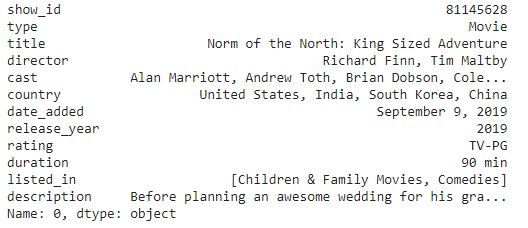

# Project B
This is the webpage showing the most important and interesting points in our analysis of the Netflix universe. The explainer notebook can be found ...

We will take a deep dive into the world of Netflix and try to investigate why it sometimes seems 

## Motivation

We've chosen a Kaggle dataset called ['Netflix Movies and TV Shows'](https://www.kaggle.com/shivamb/netflix-shows). It's a dataset containing the tv shows and movies available on Netflix as of 2019 and is obtained from [Flixable](https://flixable.com/).

Instead of looking at the entire movie industry, we chose to look only at Netflix’s ecosystem. We believe this is more interesting, as it represents a single company’s choices rather than an entire industry. This means the network might be more connected, as Netflix actively chooses who becomes part of the network - whereas in the movie industry network, the industry doesn’t choose who makes movies and thus becomes part of the network. 

Overall, we want to get a better overview of the movie industry from a private company’s point of view. Secondly, we propose the Netflix Paradox, which says that “How does Netflix have everything, but nothing at the same time”. A problem many people can acknowledge, as it appears Netflix has every type of show, but there’s never anything you want to watch. Thirdly, as maybe the least important, but also the funniest, is trying to find out if the meme that Adam Sandler is everywhere is true (As he is a well known actor that has starred in MANY movies). 

## Basic statistics
**Preprocessing the data**

The preprocessing of the data mainly revolves around correcting the format of the columns as some values are string while they should in fact be lists of strings. This change is made so that we can easily work with the data. The NaN values in the data set are changed to empty strings.

For every show, a corresponding cast is listed. This is presented as one long string; this string must be split into a list with each of the mentioned actors as a separate element. This is also true in directors, listed_in and country.

Titles of movies and tv shows are not unique, however, each of them have a unique show_id. This is used to differentiate between two shows that have the same name. This also means, that when we talking about shows, we're talking about both movies *and* TV Shows. Shows is used as an umbrella term.

**The statistics**

The dataset we have chosen to work with consists of 6234 rows of movies each containing 12 attributes.

From the data set we have created a bipartite graph connecting actors to movies if they stare in the movie. From the bipartite graph, we also generate two graphs of graphs of its projections where one has movies as nodes and one has actors as nodes.

The bipartite graph has a total of 33639 nodes, with 44310 edges between them. This network is not fully connected, thus we have chosen to work with its largest Giant Connected Component; this network consists of 28951 nodes and 40915 edges.

The projection that uses actors as nodes contains a total of 27405 and has 199559 edges between these nodes. There are edges between two actors in the graph if they have starred in the same movie. Again we have chosen to work with the largest Giant Connected Component. This GCC has 24212 nodes and 190046 nodes.

The second projection, using movies as nodes, has 5664 nodes with 39581 edges. This projection creates a graph where movies are nodes and there are edges between movies if they share a cast member. The corresponding largest GCC has 4739 nodes and 39249 edges and there is quite a large difference in between the number of nodes in the GCC compared to the remaining subgraphs in the network. This is due to some subgraphs being documentaries or similar where the cast only appear in that movie or series. For instance, the second largest connected component are all the nature documentaries with one cast member: David Attenborough. The fourth largest connected component is a series of music documentaries starring music legends. This explains why our movie projection is not fully connected as we have cast members appear in only a few movies. We therefore also choose to work on the GCC in this network. 

So for all three graphs we work on the GCC.

## Analysis
The first analysis performed on our data, was determining the degree distributions for each of the three networks.

